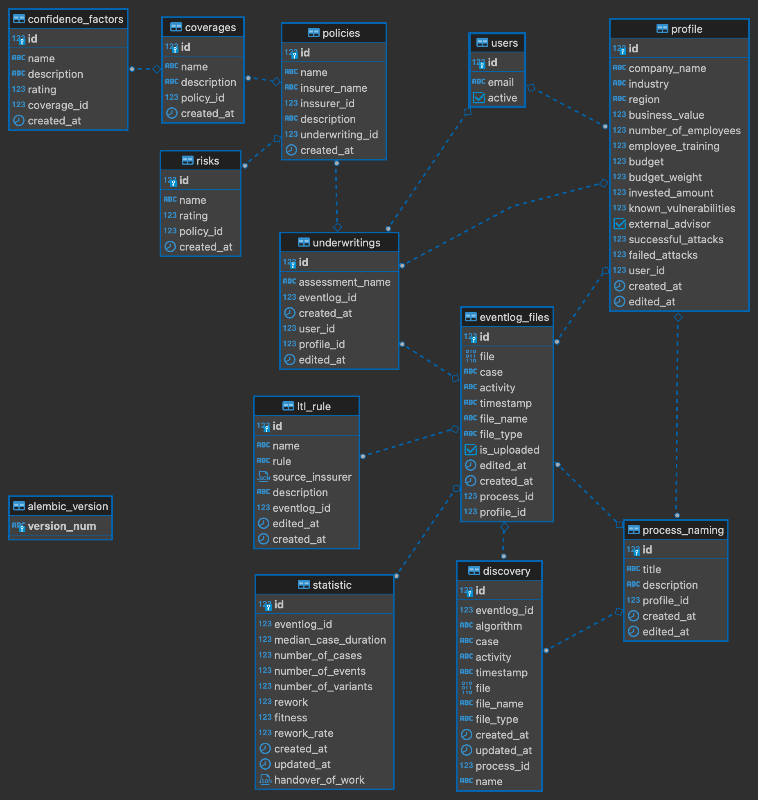

# DB descriptions

## user

Saves user name.

## profile

Saves Profile value as company_name, region, budget ect. Has relations to user table

## process_naming

Saves name for process. Has relations to profile table

## eventlog_files

Saves eventlog file and params for it. Has relations to profile and process_naming tables

## discovery

Saves BPMN file and params for it. Has relations to eventlog_files and process_naming tables

## statistic

Saves statistics data about log. Has relations to eventlog_files table

## ltl_rule

Saves LTL rule for log. Has relations to eventlog_files table

## underwritings

Saves Risk assessment data. Has relations to eventlog_files, profile, user tables

## policies

Saves Cyber Insurance Policy data. Has relations to underwritings table

## risks

Saves Enterprise-level confidence factor data. Is related to policies table.

## coverages

Is used to store data about coverage, is related to the policies table.

## confidence_factors

Saves confidence factors data. Has relations to coverages table

## alembic_version

For DB migrations. Has no relations

